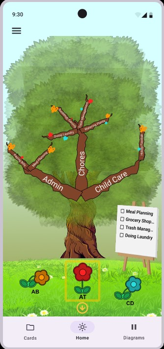
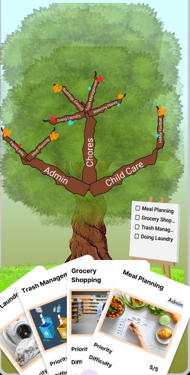
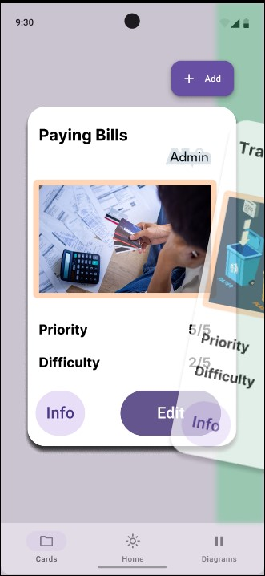
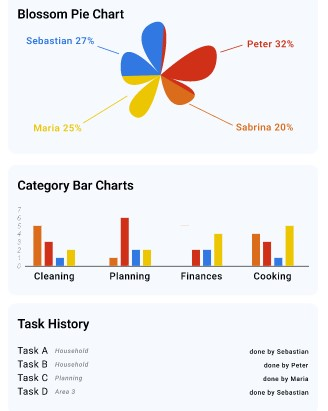
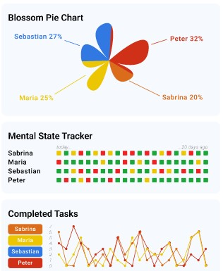
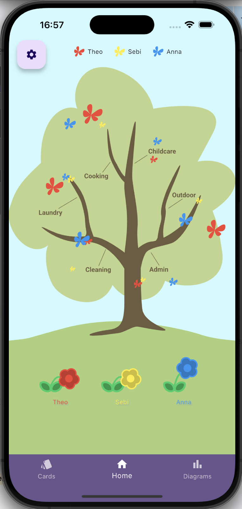
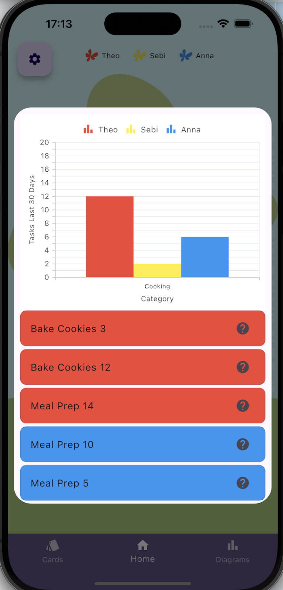
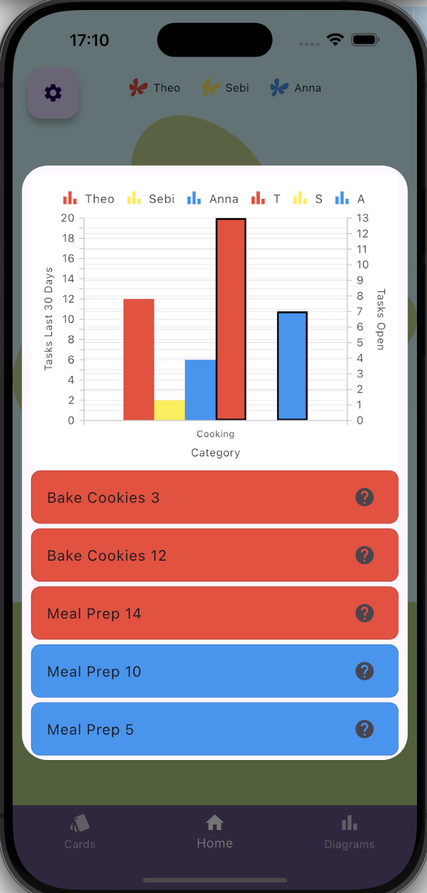

# Mental Tree, Group 16
#### Thiago Knill, Marco Weder, Khaled Kottmann, Cristina Ettlin, Marcello Krahforst, Noah von Matt
## Trailers

## Project description

In progress of improving the lifes of people with mental load by visualising it.
We want to give a better overview over mental load so people can tackle it better.

## Needfinding
First we had to figure out some good interview questions. After every group member wrote some questions down, we put them all together and discussed, which ones we can combine or strike out. Each member then conducted 2-4 interviews. The goal of the interviews was to understand our interviewees and to determine the needs and insights of potential users. Our interviewees were different kinds of people, such as a student living in a shared flat, a fresh couple living together in an apartment, full-time or part-time workers living with their families or a retired person. We then put observations, problems, quotes, needs and insights from our interviews in an affinity diagram in Figma.

In our affinity diagram we have collected needs from our interviews, each need connected with its quote. We could use them to identify the 17 needs listed below:
1. Knowing where other members currently are and when they get home
	_“Sometimes I search someone and I don’t know where he/she is”_
2. Clearer communication to prevent misunderstandings
	_“Sometimes there are some misunderstandings”_
3. Digital possibility to better communicate needs
   _“[...] we simply have an analogue shopping list.”_
4. More/earlier communication
   _“Sometimes I wish my flatmates would communicate earlier. Regarding their daily presence or their expectations of me.”_
   _“I would have to divide things up more clearly and formulate my wishes more clearly.”_
5. Distribute household planning
  *“I need to communicate more clearly what I want and work with lists.”*
6. Explaining opinions and hearing each other out
   _“Opinions need to be respected and explained.”_
7. Reduce mental load due to world events
_“And the uncertain future. [...] And that depresses me too.”_
8. More reachable flat mates and do more activities together
  _“[...] There are some people I haven’t seen in ages. I think that is the biggest problem. I simply can’t reach them and they also don’t read my messages...”_
  _“I would actually like to do more with my flatmates”_
9. Track/display emotions over time with location, people, …
  _“It would be interesting to see how highly you rate yourself.”_
10. Planning/tracking app to compare time spent on household tasks / work without giving too much private information
  _“I would refuse to write everything down in detail, it takes too much time and nobody needs to know what I did exactly and at what time”_
11. Way to compare time spent at work with time spent on household would help
  _“It would be interesting to show how much time the partner spends compared to me [at work], perhaps both have the feeling that they do more”_
12. Better participation of flat mates in household tasks
	_“It would be nice if the others would also see the problems that have to be fixed.”_
13. More acknowledgment and appreciation
  _“I think it would be interesting to see and demonstrate how time consuming everything is.”_
14. Some way to combine and simplify shopping lists and communication
  _“The notification “List has been updated” of the app Bring! is unreliable”_
15. Outsourcing of decisions
  _“My life is much easier because this [to-do list] exists.”_
16. More time for family and household
  _“My business often has priority and I just never have enough time to do everything.”_
17. Avoid Forgetfulness
  _“Even if people remind me to do something, after a short time I’ll forget to do it”_

We created 3 personas, Karin Meier, a full-time housewife living with her family, Yousef Abdullah, a full-time student living in a shared-flat of 4 people, and María Lebed, a full-time worker living with her partner. We chose these personas, because they represent different kinds of users that could use our app. 

 
Images from "Nipto: Hausarbeit teilen" and “Sweepy: Dein Putzplan”

## Ideation
### Desk Research
At the same time, we started with the desk research, i.e. all team members searched for related work such as blogs, apps, research papers or online posts. From these resources we added interesting information to our affinity diagram. The most related solution came in the form of games and apps which allow the users to distribute common household tasks and see also the management work related to them. Thus they can communicate how it currently is and how they want the distribution to be in the future. In some cases they gamified the process with points which are connected to the tasks and are rewarded to the user when completed

### How might we
From our new gained insights we then formulated seven “How might we” questions.
- How might we get data about the mental load of people without stressing them too much?
- How might we address mental load without fostering resentment between parties? 
- How might we visualize data about mental load in a way it helps users?
- How might we make the app appealing such that all members of a household use it?
- How might we ensure our solution respects the privacy of users while gathering insight on their mental load?
- How might we remind our users to use this tool as long and as much as needed?
- How might we design an app that dynamically adapts to users needs?

### Brainstorming
For the brainstorming we used the 6-3-5 approach. Every group member individually wrote 3 ideas on a sheet. After five minutes we passed the sheets to the next person and repeated the previous step. After three rounds we discussed and extended our ideas. From that we got different ideas which we then visualized in the following mind-map.
In the end we had an affinity diagram with a user-need-insight structure containing all information gained from the needfinding and the ideation.

## Reflection Milestone 1
Some parts of the reflection were directly incorporated in the previous sections.

### Needfinding
We gave a lot of time and thought into the interview questions to cover different topics of household and cohabitation, get a grasp of possible problems and how interviewees tackle them. In hindsight we probably invested too much time in this step and had to realize that the answers we got did not satisfy our expectations of getting insights into mental load and particularly getting ideas for visualizing it. Probably it’s also quite difficult to find a lot of people tracking their household tasks and especially mental load because it’s quite subjective and needs effort to do so. On the other hand we now have a solid basis about household work, communication, cohabitation and more which could come in handy in further steps e.g. when opinions in form of quotes are needed.

Most interviewees dealt intuitively with managing of household tasks by writing them down somewhere e.g. in a to-do list or calendar. They would find it helpful to have a proper overview over the tasks or the mental load connected to it but didn’t take the effort to do it so far. There were also doubts about possible conflicts and fairness if you cannot find a fair distribution and privacy regarding data that is needed to make an overview over mental factors. 
From this knowledge we created suitable personas with living circumstances, quotes and struggles they face.

### Ideation
We summarised the interview answers, categorised them first per user, went over the most important quotes, needs and insights to group them and findings from the desk research further in the affinity diagram. We also gained background knowledge like that about our users for the brainstorming session.
With all of this information we started the brainstorming session and had a lot of ideas. Most of them were related to gathering and distributing tasks because that was what our interview answers were mostly about. But there were also some about visualising it e.g. waves or trees and making it easier to report on the mental load of users e.g. one questions per day. Because visualising was our main topic we tried to focus on that but noticed that it wasn’t possible to do visualising without having data to visualise so we tried to incorporate both in the low-fidelity prototyping stage. For this we took the gathered ideas and also the personas to focus on the best suited 3 ones which we then made storyboards and prototypes about.
We had multiple discussions in the group on how to exactly do the storyboards and prototypes and especially about what because it wasn’t clear in the beginning if and how the ideas could fit together and what exactly is (less) important. In the end we agreed on doing prototyping and storyboards on different features and use cases of the final low-fidelity product.

### Measuring success
Because mental load is for a lot of our interviewees the tasks in the house and quite subjective, it is difficult to set formal measures. But the following are good measurements to create successful product:
- **How fast can tasks be managed?**: Make the task adding and management process fast so it doesn’t add mental load and costs too much time for the users to distribute tasks.
- **How easy can the mental state be communicated?**: Make it as easy as possible to add the mental state because mental load is subjective and can vary with other circumstances. It's crucial for the user to add their mental status in general but also related to the tasks.
- **How visually appealing and intuitive does the app communicate mental load and state of the users?**: Make it visually as appealing and intuitive as possible because it is especially important in a mental context to not stress the user and to communicate the gathered data unambiguously.

## Low-fidelity Prototype
The first Storyboard is about Karin. She doesn't have the groceries in the fridge to make a meal, so she goes grocery shopping. She doesn't really like grocery shopping and would rather her husband to do it. There she meets her friend who recommends her this app to divide tasks between each other and she starts using it.

The second Storyboard is about Yousef. Everybody does their tasks but think that Yousef doesn't do as much as the others. So they start using the app to see with the tree visualization, that he actually makes things that the others never thought to do. They also notice, that the others still seemed to do more than him, so they use a feature from this app to split the tasks accordingly.

In the third Storyboards we see how María and her boyfriend already are using the app. However, she got a new job and is working overtime, so she feels a little overwhelmed at the moment. She then goes to the app to adjust her mental state. Her boyfrined sees this and helps her out by fulfilling some of her tasks instead.

We decided to do two paper prototypes focusing on two different features of the app, as seen in the storyboards 1 and 2:

The first prototype is the tree which visualizes the task distribution in the houshold. This promotes a fair distribution of tasks in all task domains in the household. Besides that, the first prototype contains flowers which represent the mental state of the users. The flowers can be set to different states by the user, which incentivates discussion and a dynamic task distribution according to the users mental state and energy.

The second prototype focuses on the task distribution feature implemented by cards with tasks that are distributed among the users. The cards can be dynamically created by the users and contain information about the task priority, deadline, expectations, difficulty and category. The users can also set a task to be preferred by them, for example because they like to do a task, by pressing on it. Prioritizing a task will increase the likelihood of being assigned to it. Finally, the tasks can be assigned by shuffling them.
    
## Mid-fidelity Prototype
### Functionalities
Disclaimer: Sometimes we refer to needs in brackets e.g. “(need 9)” these refer to the identified needs listed under needfinding in this blog.
When the user first logs in there are options for choosing a name, initials (for showing abbreviations under flowers, …) and a color (for the flower color, …) 
 
There are two main ways for navigation between screens: via the navigation bar or by swiping in prototype B. The swiping was implemented in Figma over the keyboard buttons a (left) and d (right). 
 

Other features of our prototype can be divided into three main categories/screens: 
- home/tree, 
- tasks/cards 
- and insights over time/diagrams.

#### Home/Tree
 
Here each user should get an overview of their tasks (bulletin board), their assigned and completed tasks (blossoms in the tree) and their emotional state (condition of the flower).  
The visualisation of tasks via the tree and blossoms gives users a direct way to see their completed tasks and also see tasks that others have done, as interviewees have suggested would be beneficial to them.  
The bulletin board shows the not-yet-completed tasks to have a better and more playful/relaxing overview of them.  
The flower shows the user’s current mental state to aid with early communication (need 4) about mental well-being and load. Additionally the flower can be used to track and display the mood over time (as done in a diagram) (need 9).  

The features of Prototype A are:
- Tree
	- blossoms to show all completed tasks (with their user distribution)
- Flowers: visualizing mood of all members
	- possible to change own mood
	- clicking on others ⇒ seeing other tasks and possible to trade/help with tasks
- Bulletin Board: showing personal tasks 
 
Because mental load has a lot to do with the emotional well-being of a person, we tried to make the design more visually appealing by having nice and calming graphics like the tree with the blossoms, the flowers and a wooden bulletin board.

The features of Prototype B are:
- Tree
	- blossoms to show who is assigned to which tasks (one blossom per task)
- Flowers: visualizing mood of all members
	- possible to change own mood 
   	
	- clicking on others ⇒ seeing other tasks and possible to trade/help with tasks
- Bulletin Board: showing personal tasks 
    
Because mental load has a lot to do with the emotional well-being of a person, we tried to make the design more visually appealing by having nice and calming graphics like the tree with the blossoms, the flowers and a wooden bulletin board.

#### Tasks/Cards
A lot of interviewees asked for the ability to make, or did their management via, a shared to-do list, thus we incorporated the possibility to do so via task cards. That way we also get user data to later show them in diagrams over time (need 10). Through defining subtasks the users are able to clearly distinguish who is responsible for what (need 2) and to better communicate needs and expectations for a specific task (need 3).  Because we aim to address mental load created in cohabitation, tasks are generally visible to everybody in the group, but it’s also possible to make tasks private. This can be useful to track tasks just for oneself e.g. for privacy (need 10) or track work related tasks (need 11) to compare the data later.
The tasks can also be traded or one can directly help another user and take on another task (need 5, 12) and a user can also send a reminder to another one to help with forgetfulness. (need 17) As task can be recurring to reduce making decisions to not always have to define a task again to reduce decision-making (need 15). 
The scheduling mechanism allows users to distribute household planning easily and fairly (need 5). With the users being able to give their preferences tasks can be possible given to users who like a certain task more than others which may help with need 12.

The features of Prototype A are:
- Task Visualization and Management via cards
- Task attributes: Name, image, category, sub tasks (to not be too  overwhelming and knowing also about the mental load/managing tasks), priority, difficulty, frequency, private (if just want to remember or break down a task for oneself), notes  
  
- Task Distribution
	- mainly via shuffling
	- ability to mark favorite tasks with swiping (left for disklike and right for like)  
  	
	- can offer help, trade tasks (visualization similar to card games) or send reminder      

The features of Prototype B are:
- Task Visualization and Management via cards
- Task attributes: Name, image, category, sub tasks (to not be too  overwhelming and knowing also about the mental load/managing tasks), priority, difficulty, frequency, private (if just want to remember or break down a task for oneself), notes
- Task Distribution
	- mainly via shuffling
	- ability to mark favorite tasks 
  	
	- can offer help, trade tasks (visualization similar to card games) or send reminder   

#### Insights over time/Diagrams
The diagrams show different insights of tasks and mental load over time and per person to visualize how one is doing in the past (need 9), what tasks were done by whom in what category (need 10). The overview especially over time can help with need 13 and 16.

The features of Prototype A are:
- Blossom Pie Chart: task distribution of people
- category bar charts: showing number of tasks done per person per category
- Task History: showing who has done what task recently 

The features of Prototype B are:
- Blossom Pie Chart: task distribution of people
- Mental state tracker
- Overall Task Completion Graph 

### Peer Feedback
#### Testers
- Noah von Matt: 15
- Cristina Ettlin: 25
- Marcello Krahforst: 29

#### Our questions for testers
In the following I listed all questions we have prepared but due to time problems and sometimes different unexpected things the user did, maybe not clearly following or uncertain about the task, not all questions were asked to all users. For when the questions were asked, to make more sense of them, see our PDF protocols ([Protocol A](/Deliverables/Mid-fidelity-prototyping/IdeaA/HCI_PeerFeedback_ProtocolA.pdf) and [Protocol B](/Deliverables/Mid-fidelity-prototyping/IdeaB/HCI_PeerFeedback_ProtocolB.pdf) with the steps/instruction and the questions. 
- What do you think about the buttons? Is it clear what they do? (remarks on intuitive/size/contrast?)
- From 1 to 10, how clear is it what the user has to do? (→ like/dislike tasks)
- Is it clear where you have to click /swipe for liking/disliking tasks?
- Do you think the user enjoys liking/disliking tasks?
- Do you know what the flowers mean?
- \[Try to offer help for “Hobby Football”] What did you expect to happen?
- How intuitive was the trading process?
- How appealing is the tree, blossoms and the flowers?
- What do they represent?
- When do they change?
- Which flowers represent you?
- Rate all attributes of a Task from most important to least important.
- Do you think the “Cards”-layout helps you find the tasks fast?
- Was there an element you were unsure about its meaning?
- What do you think about the tree? Is it too cluttered?
- Do you like seeing the entire tree with the small elements?
- Do you like seeing the entire tree with the small elements?
- Do you prefer seeing only the categories in the zoomed out version?
- \[Zoom into a branch of the tree] How do you like this view?
- What do the diagrams tell you?
- What do the green/yellow/red pixels tell you?
- What are these curves?
- What do the bars represent?
- What is the task history?
- Which diagram is the most important?
- Which is useless?
- Is it clear how to hide curves?
- Do you think the app is intuitive?
- What is more intuitive? Swiping or pressing a button on the navigation bar?
- Do you like the segmentation into tabs (Cards, Tree and Chart tab)? Do you like the order of the tabs?
- Do you think there are features that can be further improved or that don’t exist?
- Are there unnecessary features?
- What do you think about mental state communication?
- What do you think about mental load communication?
- Do you have other thoughts for us?

#### Summary Peer Feedback
All testers thought that the idea of liking and disliking tasks is very interesting. But some testers incorrectly assumed that the like and cross symbols represent completed and uncompleted tasks.

Not everyone understood that flowers represent people and to open their own tasks, most of them then clicked on their flower, or on the hamburger menu, which leads to their own mental state or to the settings. The overview of your own tasks of prototype B was preferred, because you can see more information at first sight.

Without explanation, the term “trade” was not clear for everyone, but after a short explanation, everyone correctly performed a “trade” and a “offer help” action. For these actions, prototype B was preferred, as it is a bit easier. One tester questioned if a trade or help is useful and needed in the app, but  we believe that the interaction of the flower showing the mental state and the ability to offer help or trade tasks with other users is an important feature and addresses a core user need we idendified previousely (Communicate with others when help needed => Affinity Diagram).We don’t only want to give users a way to easily communicate their mental state, but also give others simple tools to take actions based on this to facilitate further communication and reduce the mental load that would otherwise be necessary to redistribute and organise tasks.

Some testers stated that the home screen is a bit overloaded and difficult to understand without a tutorial. We like the idea of having a tree with branches, blossoms and flowers, but the peer feedback showed us, that we have to improve it, so that it is clearer to the user. A tester thought that the home and the diagrams screen show very similar things, but the diagrams are more understandable. Our idea was that the user gets a general and quick overview of the main focus, while the diagram screen shows some more in-depth information, and we want to keep this idea. When comparing the home screens of the two prototypes, prototype B’s home screen was preferred, as it looks a bit cleaner.

One tester said that the navigation bar icons were not that good, because they weren’t intuitive enough. We want to change that, so that the first icon is a card, the second is the typical home icon and the third is a diagram icon.

Two testers told us that they think the mental state tracker was useless, while another tester called this diagram as the most helpful. We have to discuss further which diagrams we want to keep, and which ones we adapt/discard.

A tester mentioned that error messages would be helpful. As our app is rather difficult to understand, especially in the beginning, we want to add help and error messages.

In general, both prototypes were intuitive, but only after some explanation, so a tutorial or clearer instructions would be necessary. For some features we think it is best to combine both prototypes, e.g. for liking and disliking tasks. Overall, prototype B was preferred, so we want to keep this prototype and our main ideas, but improve it further, mainly the comprehensibility of the app, as this was the biggest issue.

## Reflection Milestone 2 
Our team’s experience with the mid-fidelity prototype and peer feedback phases offered valuable insights into our design process and user experience. Creating the mid-fidelity prototypes involved considerable effort, but by distributing tasks fairly, we maintained a steady workflow. We regularly shared updates and feedback, which was essential as most of us were new to Figma. Not knowing the importance of creating components early on led to extra work when we had to make visual changes later. Additionally, a lack of early communication on handling variables and states caused some struggles when putting the different components together.

The prototypes generally resonated well with users, particularly in terms of visual appeal. Users were curious and enjoyed exploring the different elements. Asking users to "think aloud" while using the app was especially useful, as it revealed how intuitive our design was (or wasn’t) in real time. However, we found that we were overly optimistic with the number of questions we could address within a 15-minute timeframe, which limited our ability to gather complete feedback on both prototypes. If we repeated the process, we’d narrow down the features to focus on.

Peer feedback highlighted a few areas for improvement. Many users didn’t initially recognize the swipe feature for navigating cards without hints. Additionally, the dislike button was sometimes confused with marking a task as completed. Some users also attempted to access their tasks by clicking the flower icon or the hamburger menu, which were intended for other functions. This feedback underscored the need to simplify and clarify the purpose of certain elements for a more intuitive experience.

In reflection, simplifying our design for ease of use and focusing on the most essential interactions would help us meet our project’s goals more effectively. Moving forward, we’ll apply these insights to make the app more intuitive and user-centered.

### Measuring Success
In the mid-fidelity phase, we evaluated our progress based on the initial measures we established, focusing specifically on task management speed, ease of mental state communication, and visual intuitiveness.

**Task Management Speed**
Our goal was to make task management quick and easy, so users wouldn’t feel additional mental load when adding or distributing tasks. Through testing, we found that when adding new tasks, users often struggled with aspects that weren’t based on the intended functionality of our app, but because we had constrained the workflow significantly to decrease the complexity of our figma prototype. This made it hard to accurately measure the ease of navigation of what we actually intended to implement. Furthermore, the swipe gesture to navigate task cards wasn’t immediately clear to everyone. This feedback showed us that to truly optimize speed, we may need to rethink the swipe feature to make it more intuitive or add clearer instructions.

**Ease of Communicating Mental State**
We aimed to make mental state input as seamless as possible, recognizing that mental load is subjective and can vary. Users generally liked the visual cues provided for communicating mental states, but some feedback indicated they would benefit from more guidance on how to rate or reflect their mental state in relation to tasks. This insight emphasized that a simple, clear approach for recording mental states is key to avoiding confusion.

**Visual Appeal and Intuitiveness**
While users found the app visually appealing, some features were not as intuitive as we intended. For example, the dislike buttons was occasionally mistaken for task completion options, indicating that we need to make each element’s function more obvious. This phase taught us that visual appeal must be more connected with it's acctual functionality.

In summary, the mid-fidelity feedback has again highlighted the importance of making our app not just visually engaging but also clear and intuitive, ensuring that features for task and mental state management remain straightforward and should not add additional mental load.

## Hi-fidelity Prototype

### Functionalities
There is one way  are two main ways for navigation between screens: via the navigation bar or by swiping in prototype B. The swiping was implemented in Figma over the keyboard buttons a (left) and d (right).  We decided on only using the navigation bar for simplicity. 
 

Other features of our prototype can be divided into three main categories/screens:
- home/tree,
- tasks/cards
- and insights over time/diagrams.

#### Home/Tree
 

Here each user should get an overview of the completed tasks per category (blossoms in the tree) and their emotional state (condition of the flower).
The visualisation of tasks via the tree and blossoms gives users a direct way to see the distribution of the completed tasks. We decided against using the bullet board to achieve more simplicity as users suggested in the peer-feedback.  The functionality of viewing only your own tasks still exists in the card screen.

The flower shows the user’s current mental state to aid with early communication (need 4) about mental well-being and load. Additionally the flower can be used to track and display the mood over time (as done in a diagram) (need 9).
 

For a less overloaded visualisation, we congregated all tasks of each category. Each category is represented by a branch in the tree and there is a blossom for each user per branch. The size of the blossoms are scaled based on how many tasks each user has completed in the past 30 days in the respective category.
Each branch/category can be pressed for additional information and users can also offer help or trade tasks directly from there, when they see that the task assignment isn’t very well balanced or they want to change it for other reasons. 

In prototype A the pop-up shows a graph of the number of tasks completed in the category by each user and a list of the current task assignments in this category. By pressing on a task in the list the users can offer help with a task or trade the task for another one.
 

In prototype B there is additionally a diagram that also shows how many tasks each user is assigned to in this category.
 

#### Tasks/Cards

A lot of interviewees asked for the ability to make, or did their management via, a shared to-do list, thus we incorporated the possibility to do so via task cards. That way we also get user data to later show them in diagrams over time (need 10). Through defining subtasks the users are able to clearly distinguish who is responsible for what (need 2) and to better communicate needs and expectations for a specific task (need 3). The tasks can also be traded or one can directly help another user and take on another task (need 5, 12) and a user can also send a reminder to another one to help with forgetfulness. (need 17) As tasks can be recurring to reduce making decisions to not always have to define a task again to reduce decision-making (need 15). The scheduling mechanism allows users to distribute household planning easily and fairly (need 5). With the users being able to give their preferences, tasks can be given to users who like a certain task more than others which may help with need 12.

The features are:
- Task Visualization and Management via cards
- Task Attributes: Name, image, category, sub tasks (to not be too overwhelming and knowing also about the mental load/managing tasks), priority, difficulty, frequency and due date, notes.
- Task Distribution
	- mainly via shuffling
	- ability to mark favorite tasks
	- can offer help, trade tasks (visualization similar to card games) or send a reminder

  
##### Task Distribution

For the task distribution the user can first get an overview of the task the household has decided on, there they can also create new tasks. Then they can swipe (or  click on buttons) the cards to assign their preferences. Afterwards they can check their assignments and adjust it if necessary. Finally they wait on the other household members to complete it as well. (the waiting can be skipped in our prototype)

There are 4 tabs/sections for better navigation:
- Overview (of tasks)
- Swipe (to assign preferences)
- Preferences (overview)
- Group (overview)
   

##### Task Management

After the task distribution is completed, the screen changes to the task overview, where you can manage your tasks.

Here the users can manage their own tasks; they can check off completed tasks, and sort and filter them to find a specific one.
They can also view all tasks or those assigned to others in their household.

There are 3 tabs for better navigation:
- All tasks
- My tasks
- Others’ tasks
  

#### Insights over time/Diagrams

As in the mid-fi prototype the diagrams show different insights of tasks and mental load over time and per person to visualize how one is doing in the past (need 9), what tasks were done by whom in what category (need 10). The overview especially over time can help with needs 13 and 16. The users from the peer-feedback liked the diagrams and the feature to just show specific users, which we therefore kept that way, as well as the overview of the moods. 

The features are:
- Mental state tracker
- Pie Chart: task distribution of people
- Overall Task Completion Graph: showing who has done what task recently (within the last 20 days)
- Task Assignment per category
- Task History

    
## User study

The prototypes change the diagram shown to the user when pressing a blossom on the
tree. Prototype B shows a combined bar chart with both the number of completed tasks in the last 30 days and the number of all the currently assigned tasks in the current shuffling period. Prototype A on the other hand, omits the latter and only shows the number of finished tasks in the last 30 days. The pre-programmed tasks vary in amount according to the selected task dataset. The small dataset contains an average of 5 tasks per category, the medium dataset contains an average of 10 and the large dataset an average of 20 tasks per user per category.

To compare the effect of the diagrams of the two prototypes on the number solving time of the given task which is trading a task with another household member in order to improve parity in task distribution among all users in all respective categories, we conducted a Wilcoxon Signed-Rank Test for each of the three differently sized datasets.
Participants answered a questionnaire based on the System Usability Scale test (SUS) containing questions on experience whilst using diagrams to complete tasks (only shown after doing all tasks with a given prototype).
Furthermore one question on task difficulty (Single Ease Question) was asked after each completed task.

The conducted tests on task completion time has resulted in the rejection of our Hypotheses that prototype B would improve the usability of the app and thus the efficiency of the users. As for the preferences of the diagrams shown in the two prototypes, the SUS score indicates that prototype A was better received, however the majority of the users, seven out of twelve, stated that they prefer prototype B over prototype A. The conflicting results from the user feedback and the SUS score indicate that there is potential in the idea of providing the user with more information, but it should be implemented differently. 

[Study Report](Deliverables/Study/HiFi User Study Report.pdf)

## Reflection

Our group was motivated about the project and we were eager to meet multiple times per week to discuss the progress and the next steps. Over time the workload got more, especially with the many features we had in mind and wanted to incorporate to get data for visualising mental load in the first place. Therefore next time we would improve our time management and prioritization of the features according to the prototype and different testing and the specific needed features for these different levels of the project. Due to the longer than expected implementation phase for the Hi-fi-prototype we struggled with the feature finding and implementation for the A/B testing. We had a meeting with the TA for clarification where we changed the A/B feature which meant little time for implementation and user testing. But in the end we were able to get the feature and were able to do 12 user tests. 

We received valuable feedback from our peers and were able to adapt certain features or discard others, to make them more visually appealing and easier to use. However sometimes it was hard to decide what to pursue further and what to discard because of conflicting feedback, but this also forced us to reexamine our ideas and look over the received user data again.
It was useful to learn about issues users encountered, that we hadn’t even considered like focusing more on a single user even in an application with high interaction with others or taking other circumstances into account then just the concrete household tasks when it comes to mental and household load. On the other side we learned to focus more on specific things instead of doing everything which is not feasible.
We’ve seen that in the UCD workflow the (direct) user feedback can sometimes be more confusing with opposing opinions about certain features. Additionally for the good user feedback you need to find enough suitable users which can be difficult in some situations.

